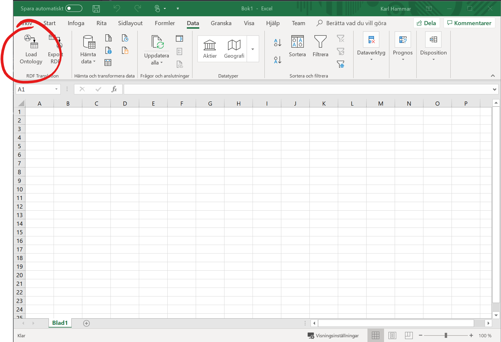
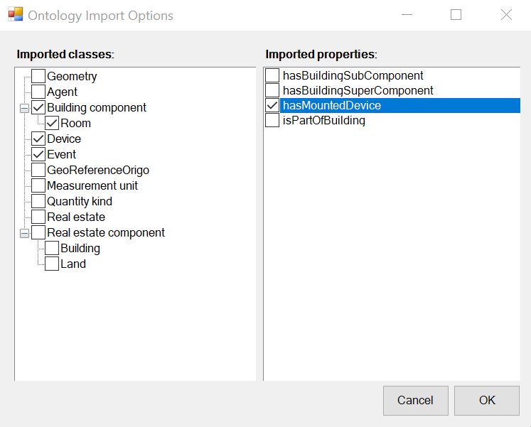
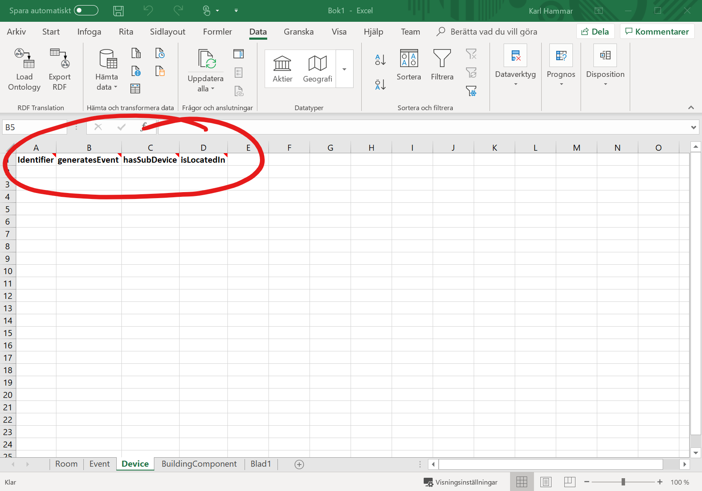
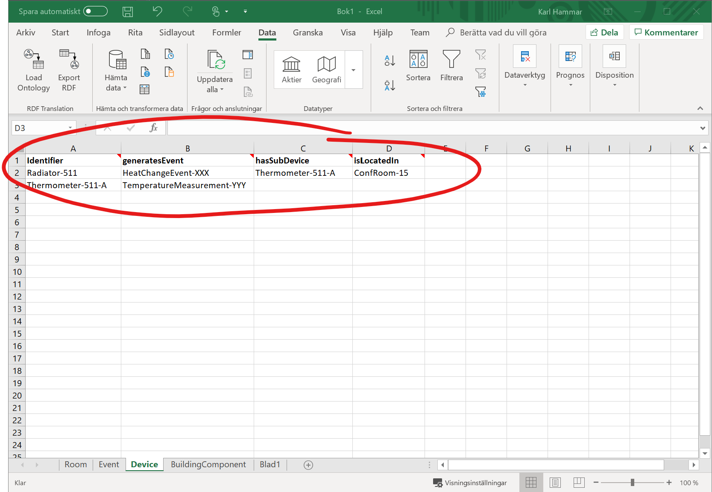
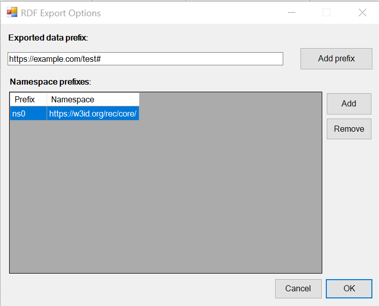

# ExcelRDF Documentation

## Functionality

The purpose of this VSTO plugin is to provide light-weight translation from OWL to XLS, and from XLS to RDF, to enable linked data generation from existing Excel-based tools and workflows.

The plugin creates a rudimentary Excel skeleton based on an OWL ontology file, with worksheets representing the classes in the ontology, and columns representing the object or data properties that apply to said classes (i.e., that have a given class in their rdfs:domain declarations). The plugin adds a header row to each sheet containing human-readable labels for the columns and some metadata for each property encoded as newline-separated Excel notes on the header cells (property IRI, property type, and property range). Additionally an *Identifier* column is added, to be used for minting the IRIs of the generated named individuals. This column has similar note-based metadata added, indicating that it is an IRI minting column, and the IRI of the class the sheet represents.

When exporting such an Excel skeleton to RDF (whether created wholly in this plugin, or also involving manual annotation work), the plugin iterates over the sheets and rows, creating a named individual per row, with the property assertions given by the data provided in the columns. Note that the plugin at this time does not validate the correctness of that data, it simply tacks together the data provided in the sheet. It is thus the responsibility of the user to ensure, for instance, that cells which will be exported as xsd:integers actually hold data that is formatted as integers.

## Requirements

* Microsoft Excel for Windows.

## Installation instructions

1. Add the project site from which the ClickOnce solution is served (i.e., [https://karlhammar.com/ExcelRDF/distribution/](https://karlhammar.com/ExcelRDF/distribution/)) to Trusted Sites list in the Windows Control Panel. This is required as I do not have a for-pay code-signing certificate. Do as follows:
    1. Click on Start.
    2. Type **inetcpl.cpl**, and then press Enter.
    3. The Internet Properties window will open. Select the **Security** tab.
    4. Selected **Trusted Sites** and then click on the **Sites** button.
    5. In the **Add this website to the zone** box, type in the website that you want to add ([https://karlhammar.com/ExcelRDF/distribution/](https://karlhammar.com/ExcelRDF/distribution/)).
    6. Click on the **Close** button, and the **OK** button.
2. Download and execute setup.exe from the [releases page](https://github.com/hammar/ExcelRDF/releases).
3. The Windows 10 SmartScreen filter may try to prevent launching the file. If so, override it by selecting **More information** and **Run anyway**.
4. Subsequently the prerequisite .NET Framework versions will be installed (which will require superuser credentials), and the VSTO plugin itself will then be installed. You may in the latter phase again be warned about installing unsigned software. Override this warning and install anyway.
5. Launch Excel and see the instructions given below.

## Usage instructions

### Loading an ontology file

1. Create a new empty Excel document.
2. Go to the **Data** tab in the Excel ribbon menu.
3. Click on the **Load Ontology** button in the ribbon (see figure below).
4. After selecting the OWL file to use (supported formats: RDF/XML, Turtle, JSON-LD, NTriples, NQuads, TriG), a dialog will appear from which you select the classes and properties that you wish to include (see figure below).
5. Press OK and sheets and columns based on your selection will be created (see figure below).

{:style="border: 1px solid black; margin-left: 20%; width: 75%"}

{:style="border: 1px solid black; margin-left: 20%; width: 75%"}

### Exporting data as RDF

1. Load up an Excel file containing ExcelRDF-compliant note-based metadata (e.g., as generated by loading an ontology file as discussed above).
2. Populate the second row and onwards of each sheet with the data you want to export (see figure below).
3. Go to the **Data** tab in the Excel ribbon menu.
4. Click on the **Export RDF** button in the ribbon (see figure below).
5. A dialog will appear asking you which namespace prefix you wish to use for your generated named individuals, and which namespace mappings to include in the generated RDF file (see figure below). A suggestion for the latter will be generated by parsing through the IRIs expressed in the metadata, but manual curation may be needed. Select reasonable options and press OK to save an RDF file to disk in one of the supported formats (RDF/XML, NTriples, Turtle).

{:style="border: 1px solid black; margin-left: 20%; width: 75%"}

{:style="border: 1px solid black; margin-left: 20%; width: 75%"}

{:style="border: 1px solid black; margin-left: 20%; width: 75%"}

## Acknowledgements

This plugin reuses [dotNetRDF](http://www.dotnetrdf.org/), a freely (MIT) licensed and very useful library for RDF/ontology parsing, managing, querying, etc. in .NET environments.
