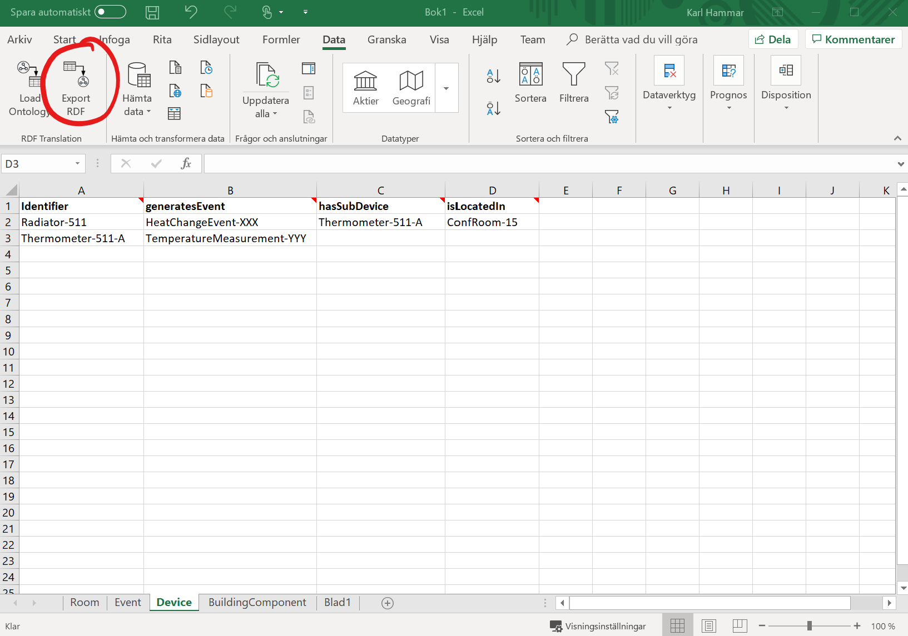

# ExcelRDF Documentation

## Functionality

The purpose of this VSTO plugin is to provide light-weight translation from OWL to XLS, and from XLS to RDF, to enable linked data generation from existing Excel-based tools and workflows.

The plugin creates a rudimentary Excel skeleton based on an OWL ontology file, with worksheets representing the classes in the ontology, and columns representing the object or data properties that apply to said classes (i.e., that have a given class in their rdfs:domain declarations). The plugin adds a header row to each sheet containing human-readable labels for the columns and some metadata for each property encoded as newline-separated Excel notes on the header cells (property IRI, property type, and property range). Additionally an *Identifier* column is added, to be used for minting the IRIs of the generated named individuals. This column has similar note-based metadata added, indicating that it is an IRI minting column, and the IRI of the class the sheet represents.

When exporting such an Excel skeleton to RDF (whether created wholly in this plugin, or also involving manual annotation work), the plugin iterates over the sheets and rows, creating a named individual per row, with the property assertions given by the data provided in the columns. Note that the plugin at this time does not validate the correctness of that data, it simply tacks together the data provided in the sheet. It is thus the responsibility of the user to ensure, for instance, that cells which will be exported as xsd:integers actually hold data that is formatted as integers.

## Requirements

* Microsoft Excel for Windows.

## Installation instructions

*Note:* Due to the lack of a code-signing certificate, a previous build of this plugin required users to add this website to their Trusted Sites list in the Windows Control Panel. I have now obtained such a certificate and signed the 1.0 build using it, so that procedure is no longer necessary. If you added this site to your Trusted Sites list, you can probably remove it now.

1. Download and execute setup.exe from the [releases page](https://github.com/hammar/ExcelRDF/releases).
2. The Windows 10 SmartScreen filter may try to prevent launching the file. If so, override it by selecting **More information** and **Run anyway**.
3. Subsequently the prerequisite .NET Framework versions will be installed (which will require superuser credentials), and the VSTO plugin itself will then be installed. You may in the latter phase be asked about if you trust the issuer who signed the software. Indicate that you do, and continue installing.
4. Launch Excel and see the instructions given below.

## Usage instructions

### Loading an ontology file

1. Create a new empty Excel document.
2. Go to the **Data** tab in the Excel ribbon menu.
3. Click on the **Load Ontology** button in the ribbon (see figure below).
4. After selecting the OWL file to use (supported formats: RDF/XML, Turtle, JSON-LD, NTriples, NQuads, TriG), a dialog will appear from which you select the classes and properties that you wish to include (see figure below).
5. Press OK and sheets and columns based on your selection will be created (see figure below).

### Exporting data as RDF

1. Load up an Excel file containing ExcelRDF-compliant note-based metadata (e.g., as generated by loading an ontology file as discussed above).
2. Populate the second row and onwards of each sheet with the data you want to export (see figure below).
3. Go to the **Data** tab in the Excel ribbon menu.
4. Click on the **Export RDF** button in the ribbon (see figure below).
5. A dialog will appear asking you which namespace prefix you wish to use for your generated named individuals, and which namespace mappings to include in the generated RDF file (see figure below). A suggestion for the latter will be generated by parsing through the IRIs expressed in the metadata, but manual curation may be needed. Select reasonable options and press OK to save an RDF file to disk in one of the supported formats (RDF/XML, NTriples, Turtle).

### Nested individuals

Occasionally you may have poorly normalized data in which several columns in the Excel sheet have some shared characteristics that would make them suitable for representation as an own individual in the generated RDF graph. For instance, as shown in the figure below, you may have a table called *Staff Members*, containing some columns indicating the starting date of a particular staff member, and their job title -- data which, in the generated graph, you would want to split out into a separate node of the type *Employment*, connected to your staff member instances via an object property.

ExcelRDF allows you to generate skeletons from your ontology that adhere to such a denormalized structure; and to parse any data expressed in accordance with the skeleton, back into RDF graphs. In order to do this, when importing the ontology as described above, right-click on a property that you have selected for inclusion in the generated skeleton. This brings up a menu (see figure below) from which you can set the property range to be either a named individual or a nested anonymous individual. In the former case (which is the default), ExcelRDF will create only one column for this property, and will when exporting an RDF graph treat the content of this column as RDF literals or IRIs (depending on the type of property).

In the latter case however, ExcelRDF will create a number of columns (depending on what you select in the *Anonymous Individual Properties* sub-menu, see figure below), and the software will at export time treat the content of all of these columns as properties on a new anonymous individual, connected to the original individual via the initially selected property.

## Acknowledgements

This plugin reuses [dotNetRDF](http://www.dotnetrdf.org/), a freely (MIT) licensed and very useful library for RDF/ontology parsing, managing, querying, etc. in .NET environments.
